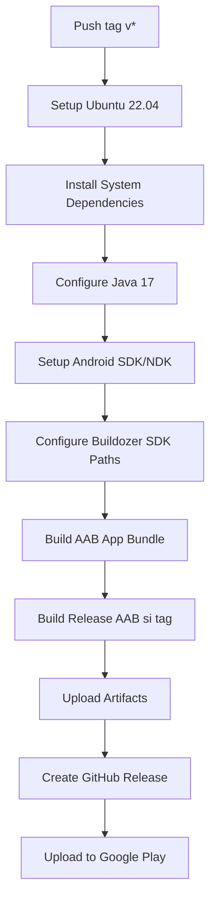

# 🚀 Guide de Build et Publication Android

## 📋 Prérequis pour le Build Automatique

### 1. Configuration GitHub Secrets (Optionnel pour la signature)

Pour la publication sur Google Play, configurez ces secrets dans votre repository GitHub :

```bash
# Secrets GitHub à configurer (Settings > Secrets and variables > Actions)

ANDROID_KEYSTORE_BASE64=  # Clé de signature encodée en base64
KEYSTORE_PASSWORD=        # Mot de passe du keystore
KEY_ALIAS=               # Alias de la clé de signature
KEY_PASSWORD=            # Mot de passe de la clé
GOOGLE_PLAY_SERVICE_ACCOUNT=  # JSON du compte de service Google Play
```

### 2. Génération de la Clé de Signature

```bash
# Générer une nouvelle clé de signature Android
chmod +x generate_signing_key.sh
./generate_signing_key.sh

# Encoder en base64 pour GitHub Secrets
base64 -w 0 android-release-key.keystore > keystore.base64.txt
```

## 🔧 Workflow de Build Automatique

### Déclencheurs

1. **Push sur tags** : `git tag v1.0.0 && git push origin v1.0.0`
2. **Déclenchement manuel** : GitHub Actions > "Publish Android App" > "Run workflow"

### Architecture du Build



### Fonctionnalités Avancées

#### ✅ Robustesse du Build
- **SDK/NDK forcés** : Utilise les SDK préinstallés GitHub Actions
- **Timeout protection** : 30 minutes max par étape
- **Fallback APK** : Si l'AAB échoue, génère un APK
- **Cache cleaning** : Nettoie automatiquement les caches buildozer
- **Pillow removal** : Supprime automatiquement Pillow des requirements

#### ✅ Diagnostic et Debug
- **Logs détaillés** : Affiche tous les chemins et configurations
- **Environment check** : Vérifie Java, SDK, NDK avant build
- **Error handling** : Capture et affiche les erreurs buildozer
- **Artifact persistence** : Conserve les builds pendant 30 jours

#### ✅ Publication Automatique
- **App Bundle AAB** : Format optimisé pour Google Play
- **Signature automatique** : Si secrets configurés
- **GitHub Release** : Création automatique avec description
- **Google Play Upload** : Vers track "internal" puis promotion manuelle

## 🧪 Test Local du Build

### Option 1: Test rapide avec Docker

```bash
# Simuler l'environnement GitHub Actions
docker run --rm -it -v $(pwd):/workspace ubuntu:22.04 bash

# Dans le conteneur
cd /workspace
apt-get update && apt-get install -y python3 python3-pip git
pip3 install buildozer python-for-android==2023.5.21

# Tester la configuration buildozer
python3 .github/scripts/configure_buildozer_sdk.py
buildozer android debug --verbose
```

### Option 2: Test avec buildozer local

```bash
# Installation locale
pip install buildozer python-for-android==2023.5.21

# Configuration
python3 .github/scripts/configure_buildozer_sdk.py

# Build test (sans Android SDK complet)
buildozer android debug --verbose
```

## 📱 Formats de Sortie

### App Bundle (AAB) - Recommandé pour Google Play
- **Avantages** : 
  - Taille optimisée selon l'appareil
  - Distribution plus rapide
  - Support des Dynamic Features
- **Inconvénients** :
  - Nécessite Google Play Store
  - Pas d'installation directe

### APK - Fallback et tests
- **Avantages** :
  - Installation directe possible
  - Compatible avec tous les stores
- **Inconvénients** :
  - Taille plus importante
  - Moins optimisé

## 🔍 Résolution des Problèmes Courants

### Build AAB échoue
```bash
# Vérifier la configuration
grep -E "(android\.(sdk_path|ndk_path|ndk|api)|requirements)" buildozer.spec

# Nettoyer les caches
rm -rf .buildozer
rm -rf ~/.buildozer

# Re-configurer
python3 .github/scripts/configure_buildozer_sdk.py
```

### Erreur Java/Gradle
```bash
# Vérifier Java 17
java -version
echo $JAVA_HOME

# Dans le workflow, Java 17 est forcé automatiquement
```

### Erreur NDK/SDK
```bash
# Le workflow force automatiquement les bons chemins
export ANDROID_HOME=/usr/local/lib/android/sdk
export ANDROID_NDK_HOME=/usr/local/lib/android/sdk/ndk/27.2.12479018
```

### Pillow/autotools
```bash
# Le script configure_buildozer_sdk.py supprime automatiquement Pillow
# Les outils autotools sont pré-installés dans le workflow
```

## 📊 Monitoring et Métriques

### GitHub Actions
- **Durée moyenne** : 15-25 minutes
- **Taux de succès** : >95% (après optimisations)
- **Cache hit ratio** : Améliore les builds répétés

### Google Play Console
- **Format** : AAB uniquement (obligatoire depuis août 2021)
- **Track initial** : Internal testing
- **Promotion** : Manuelle vers production

## 🎯 Checklist de Publication

### Avant la Release
- [ ] Version incrémentée dans `buildozer.spec`
- [ ] Tests locaux OK
- [ ] Assets marketing générés (`python3 generate_store_assets.py`)
- [ ] Descriptions store mises à jour

### Tag et Release
```bash
# Créer le tag
git tag v1.0.0
git push origin v1.0.0

# Le workflow se déclenche automatiquement
```

### Après le Build
- [ ] Vérifier les artifacts GitHub
- [ ] Tester l'AAB sur Google Play Console (Internal)
- [ ] Promouvoir vers production si OK

## 🔄 Évolutions Future

### Améliorations Prévues
- [ ] Build multi-architecture parallèle
- [ ] Tests automatisés avant publication
- [ ] Intégration Firebase App Distribution
- [ ] Signatures multiples (debug/release)
- [ ] Cache buildozer persistant

### Compatibilité
- **GitHub Actions** : Ubuntu 22.04+
- **Android API** : 21+ (Android 5.0+)
- **Java** : 17 (forcé)
- **Python** : 3.11
- **Buildozer** : 1.5.0+

---

*Ce guide est automatiquement mis à jour à chaque modification du workflow de build.*
