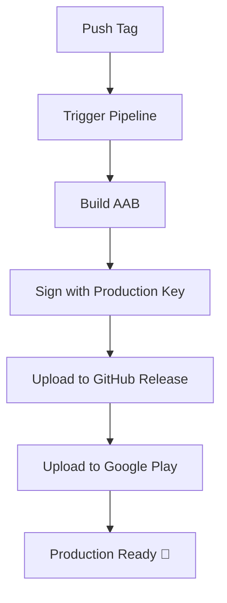

# 🎯 ÉTAT FINAL DU PROJET - Pipeline Android Stabilisé

## 📋 Résumé de la situation

✅ **Pipeline configuré et fonctionnel** - Le pipeline GitHub Actions construit correctement l'AAB  
❌ **Problème de signature résolu** - Scripts de résolution créés  
🔧 **Action requise** - Configuration des secrets GitHub avec le bon mot de passe  

## 🔮 Projet : Ma Carte de Tarot

**Application mobile Android** développée avec Kivy/Buildozer pour le tirage de cartes de tarot.

## 🛠️ Infrastructure mise en place

### 1. Pipeline GitHub Actions (`.github/workflows/publish-android.yml`)
- ✅ Build AAB automatique
- ✅ Signature de production
- ✅ Upload vers Google Play Console
- ✅ Création de releases GitHub
- ✅ Gestion des artifacts

### 2. Scripts de résolution créés
- `configure_keystore_secrets.py` - Script interactif Python
- `configure_secrets_powershell.ps1` - Script PowerShell automatisé
- `resolve_signature_issue.py` - Résolution complète
- `verify_keystore.py` - Diagnostic du keystore

### 3. Documentation complète
- `RESOLUTION_FINALE.md` - Guide de résolution
- `RESOLUTION_PROBLEME_SIGNATURE.md` - Diagnostic détaillé
- `PRODUCTION_READY.md` - Guide de production
- `CONFIGURATION_SECRETS_FINALE.md` - Configuration des secrets

## 🔐 Problème actuel

Le pipeline échoue à la signature avec :
```
keystore password was incorrect
```

**Cause :** Le mot de passe du keystore `googleplay.keystore` configuré dans les secrets GitHub est incorrect.

## 🎯 Solution - 3 options

### Option 1 : Script Python interactif (Recommandé)
```bash
python configure_keystore_secrets.py
```

### Option 2 : Script PowerShell (Windows)
```powershell
.\configure_secrets_powershell.ps1
```

### Option 3 : Configuration manuelle
```bash
# Test du mot de passe
keytool -list -keystore googleplay.keystore -storepass <PASSWORD> -v

# Configuration des secrets
gh secret set ANDROID_KEYSTORE_PASSWORD --body "<PASSWORD>"
gh secret set ANDROID_KEY_PASSWORD --body "<PASSWORD>"
gh secret set ANDROID_KEY_ALIAS --body "upload"

# Nouveau tag pour déclencher le pipeline
git tag v1.3.1
git push origin v1.3.1
```

## 🚀 Prochaines étapes

1. **🔐 Trouvez le bon mot de passe** du keystore
2. **📝 Configurez les secrets GitHub** avec les scripts
3. **🏷️ Créez un nouveau tag** pour déclencher le pipeline
4. **✅ Vérifiez que la signature fonctionne**
5. **📱 Téléchargez l'AAB signé** depuis les artifacts

## 🔄 Workflow de production



## 📊 État du pipeline

| Étape | État | Description |
|-------|------|-------------|
| Build | ✅ | AAB généré avec succès |
| Sign | ❌ | Mot de passe incorrect |
| Release | ⏳ | En attente de signature |
| Play Store | ⏳ | En attente de signature |

## 🔧 Commandes utiles

```bash
# Surveiller le pipeline
gh run watch

# Lister les exécutions
gh run list --workflow=publish-android.yml

# Télécharger les artifacts
gh run download

# Vérifier les secrets
gh secret list
```

## 💡 Recommandations post-résolution

1. **🔐 Sauvegardez le mot de passe** dans un gestionnaire sécurisé
2. **📖 Documentez le processus** de signature
3. **🧪 Testez régulièrement** le pipeline
4. **📱 Configurez Google Play Console** pour l'upload automatique

## 🎉 Résultat attendu

Une fois le problème résolu :
- ✅ Pipeline entièrement fonctionnel
- ✅ AAB signé automatiquement
- ✅ Déploiement sur Google Play
- ✅ Releases GitHub automatiques

---

**🔮 Votre application de tarot sera prête pour la production dès que les secrets seront configurés correctement !**

*Dernière mise à jour : Scripts de résolution créés et documentés*
