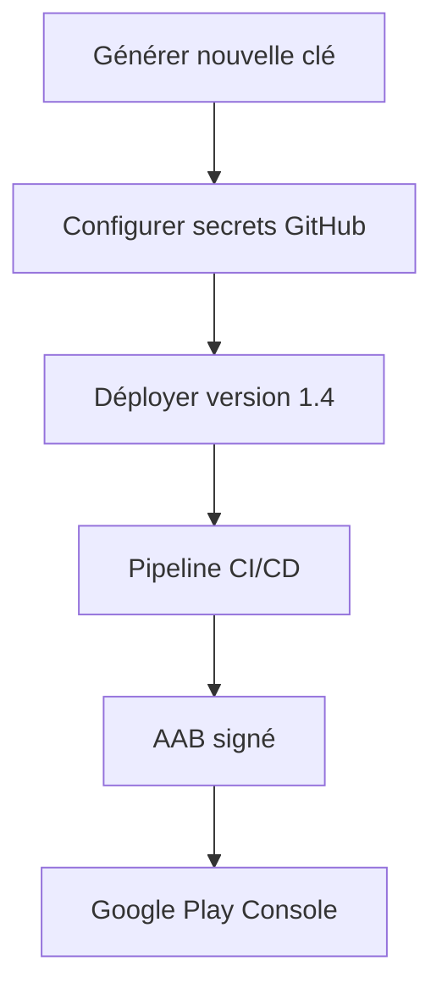

# 🔐 Guide complet - Nouvelle clé de signature Android

## 📋 Situation actuelle

Vous avez une version 0.1 signée avec une clé temporaire sur Google Play. Nous devons créer une nouvelle clé de signature pour les futures versions.

## 🎯 Objectif

Générer une nouvelle clé de signature permanente et déployer la version 1.4 avec cette clé.

## 🛠️ Procédure complète

### Étape 1: Générer la nouvelle clé

```bash
python generate_new_keystore.py
```

Ce script va :
- 🔐 Créer une nouvelle clé `googleplay.keystore`
- 📝 Mettre à jour `buildozer.spec` avec les bonnes configurations
- 🔄 Générer les scripts de configuration des secrets GitHub
- 💾 Sauvegarder l'ancienne clé en backup

**Informations recommandées :**
- Mot de passe keystore : `macartedetarot2024`
- Alias : `upload`
- Nom : `Ma Carte de Tarot`
- Organisation : `Tarot App`

### Étape 2: Configurer les secrets GitHub

```powershell
# Windows PowerShell
.\configure_new_secrets.ps1

# Ou Linux/Mac
./configure_new_secrets.sh
```

### Étape 3: Déployer avec la nouvelle clé

```bash
python deploy_with_new_key.py
```

Ce script va :
- 📝 Mettre à jour la version dans `buildozer.spec`
- 🔄 Commiter les changements
- 🏷️ Créer le tag `v1.4.0`
- 🚀 Pousser et déclencher le pipeline

## 📱 Résultat attendu

Après ces étapes, vous aurez :
- ✅ Une nouvelle clé de signature permanente
- ✅ Version 1.4 déployée avec cette clé
- ✅ Pipeline qui fonctionne correctement
- ✅ AAB signé prêt pour Google Play

## 🔄 Workflow automatique



## 📋 Commandes rapides

```bash
# Tout en une fois
python generate_new_keystore.py
.\configure_new_secrets.ps1
python deploy_with_new_key.py

# Puis surveiller le pipeline
gh run watch
```

## 🎯 Avantages de cette approche

1. **🔐 Sécurité** : Clé permanente avec mot de passe fort
2. **🔄 Automatisation** : Pipeline entièrement automatisé
3. **📝 Documentation** : Toute la configuration est tracée
4. **🛡️ Backup** : Ancienne clé sauvegardée
5. **🚀 Déploiement** : Version 1.4 prête pour production

## 📱 Google Play Console

Pour la première version avec la nouvelle clé :
1. 🌐 Allez sur [Google Play Console](https://play.google.com/console/)
2. 📂 Sélectionnez votre app
3. 🚀 Créez une nouvelle version
4. 📤 Uploadez l'AAB signé depuis les artifacts GitHub
5. ✅ Publiez en test interne puis en production

## 🔧 Dépannage

### Problème : "Keystore not found"
```bash
# Vérifier la présence du keystore
ls -la googleplay.keystore
```

### Problème : "Secrets not configured"
```bash
# Vérifier les secrets GitHub
gh secret list
```

### Problème : "Pipeline fails"
```bash
# Voir les logs du pipeline
gh run list --workflow=publish-android.yml
gh run view <RUN_ID> --log
```

## 💡 Conseils

1. **🔐 Sauvegardez** le mot de passe dans un gestionnaire sécurisé
2. **📝 Documentez** les informations de la clé
3. **🧪 Testez** l'app avant publication
4. **👀 Surveillez** le pipeline après déploiement
5. **🔄 Automatisez** les futurs déploiements

## 🎉 Prochaines versions

Une fois cette configuration terminée, les futurs déploiements seront simples :

```bash
# Mettre à jour la version dans buildozer.spec
# Puis :
git add .
git commit -m "feat: nouvelle version X.Y"
git tag vX.Y
git push origin main
git push origin vX.Y
```

---

**🔮 Votre app de tarot sera bientôt prête avec une signature permanente et sécurisée !**
