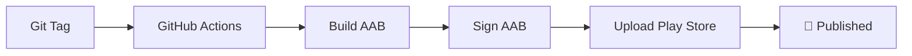

# 📱 Pipeline CI/CD Android - Application Kivy Tarot

## 🎯 Vue d'ensemble

Ce repository contient une application Kivy de tirage de cartes de tarot avec un **pipeline CI/CD automatisé** pour publication sur Google Play Store.

### ✨ Fonctionnalités

- 🃏 Application de tirage de cartes de tarot avec interface graphique Kivy
- 🔧 Build automatique Android (AAB) avec API 34
- 🔐 Signature automatique avec clé de production
- 📤 Upload automatique sur Google Play Console
- 🚀 Déploiement sur tag Git (ex: `v1.0.1`)

## 🏗️ Architecture du Pipeline



### 📁 Structure du projet

```
kivy_app/
├── main.py                           # Application principale
├── macartedetarotapp.kv              # Interface Kivy
├── buildozer.spec                    # Configuration build Android
├── requirements.txt                  # Dépendances Python
├── .github/workflows/
│   └── publish-android.yml           # Workflow principal CI/CD
├── scripts/                          # Scripts d'automatisation
│   ├── deploy_complete.py            # Déploiement complet
│   ├── trigger_build.py              # Déclenchement build
│   ├── check_ready_for_build.py      # Vérifications
│   └── update_github_secrets.py      # Configuration secrets
├── tarot_img/                        # Images et icônes
└── docs/                             # Documentation complète
```

## 🚀 Déploiement Rapide

### 1. Premier déploiement

```bash
# Vérifier que tout est prêt
python check_ready_for_build.py

# Lancer le déploiement complet
python deploy_complete.py v1.0.1
```

### 2. Déploiements suivants

```bash
# Simple: créer un tag déclenche automatiquement le build
python trigger_build.py v1.0.2
```

## ⚙️ Configuration Détaillée

### 🔐 Secrets GitHub requis

Dans `Settings > Secrets and variables > Actions` :

| Secret | Description | Valeur |
|--------|-------------|---------|
| `ANDROID_KEYSTORE` | Clé de signature (base64) | Générée automatiquement |
| `ANDROID_KEYSTORE_PASSWORD` | Mot de passe keystore | `GooglePlay2025!` |
| `ANDROID_KEY_ALIAS` | Alias de la clé | `googleplay` |
| `ANDROID_KEY_PASSWORD` | Mot de passe clé | `GooglePlay2025!` |
| `GOOGLE_PLAY_SERVICE_ACCOUNT` | Clé API Google Play | JSON complet |

### 📱 Configuration Google Play Console

1. **Activez l'API Google Play Console**
2. **Créez un compte de service** avec permissions Publisher
3. **Uploadez le premier AAB manuellement** (requis par Google)
4. **Configurez les informations de l'app** (description, screenshots, etc.)

## 🛠️ Scripts Utiles

### 🔍 Diagnostic et vérification
```bash
python check_ready_for_build.py     # Vérification complète
python check_complete_setup.py      # État des clés et certificats
```

### 🔨 Build local
```bash
python build_aab_api34.py            # Build AAB local avec API 34
python sign_aab_local.py             # Signature manuelle d'un AAB
```

### 🔐 Gestion des clés
```bash
python generate_signing_key.py      # Génération clé de signature
python setup_google_play_api.py     # Configuration API Google Play
```

## 📊 Workflow GitHub Actions

Le workflow `publish-android.yml` s'exécute automatiquement sur:
- ✅ **Tags Git** (ex: `v1.0.1`)
- ✅ **Déclenchement manuel** (workflow_dispatch)

### Étapes du workflow:

1. **🔧 Setup** - Python 3.11, Java 17, Android SDK/NDK
2. **📦 Dependencies** - Buildozer, Kivy, Cython, etc.
3. **🎨 Prepare** - Icône PNG, corrections buildozer
4. **🏗️ Build** - Génération AAB avec API 34
5. **🔐 Sign** - Signature automatique avec clé de production
6. **📤 Upload** - Publication sur Google Play Console
7. **📧 Notify** - Notification de succès/échec

## 📱 Exigences Google Play

✅ **Conformité assurée:**
- 🎯 API Level 34 (Android 14)
- 📦 App Bundle (AAB) format
- 🔐 Signature v2/v3 avec clé de production
- 📱 AndroidX enabled
- 🛡️ Permissions minimales
- 📏 Icônes aux bonnes dimensions

## 🔄 Workflow de développement

### Pour une nouvelle feature:

1. **Développez** localement
2. **Testez** avec `python main.py`
3. **Committez** vos changements
4. **Créez un tag**: `python trigger_build.py v1.0.2`
5. **Surveillez** le build dans GitHub Actions
6. **Vérifiez** l'upload sur Google Play Console

### 🐛 Dépannage

| Problème | Solution |
|----------|----------|
| Build échoue | Vérifiez les logs GitHub Actions |
| Signature échouée | Vérifiez les secrets GitHub |
| Upload Play Store échoué | Vérifiez la clé de service Google Play |
| AAB rejeté | Vérifiez l'API level et les permissions |

## 📞 Support et Documentation

- 📚 **Documentation complète**: `/docs/`
- 🔧 **Scripts de diagnostic**: Tous dans le dossier racine
- 📊 **Logs GitHub Actions**: Onglet Actions du repository
- 🎮 **Google Play Console**: [console.cloud.google.com](https://console.cloud.google.com)

## 🎉 Résultat Final

Après configuration, votre application sera:

✅ **Buildée automatiquement** à chaque tag  
✅ **Signée avec clé de production**  
✅ **Uploadée sur Google Play Store**  
✅ **Prête pour publication**  

---

**🎯 Votre pipeline CI/CD Android est opérationnel !**

Pour toute question, consultez la documentation dans `/docs/` ou utilisez les scripts de diagnostic.
